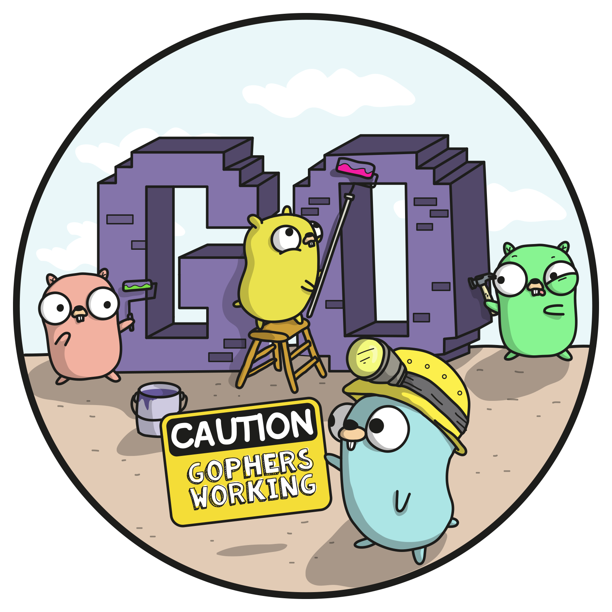

# golimiter
[](https://github.com/Bose/golimiter/blob/master/godoc.md) 


A rate limiter for Go that uses a fixed-window approach to tracking rates.  Each incoming request increments the counter of the window.  If the counter exceeds the limit, the request is denied.   

Counter storage: golimiter's implementation uses an in memory store (LRU with expiry and a bound upper limit of entries). It also also includes a distributed counter store using Redis.  For performance reasons, this distributed store will be eventually consistent with the in memory store.  The centralized store will be updated using a set-then-get approach, relying on atomic Redis operators to eliminate race conditions under high-concurrency.  The central store is optional... if it's not configured, then golimiter is happy to just keep working by only using it's in memory store.

## Middleware
Golimiter includes Gin middleware and an example how-to service. 

## Installation

`$ go get github.com/Bose/golimiter`

You'll also want to install go-cache for counter storage.

`$ go get "github.com/Bose/go-cache`

## Benchmarks (for the rate limiter itself)
```bash
$ ./run-benchmarks.sh 
goos: darwin
goarch: amd64
pkg: github.com/Bose/golimiter
BenchmarkIncrInMemory1-8    	 1000000	      1903 ns/op
BenchmarkIncrInMemory2-8    	 1000000	      1910 ns/op
BenchmarkIncrInMemory3-8    	 1000000	      1929 ns/op
BenchmarkIncrInMemory10-8   	 1000000	      1912 ns/op
BenchmarkIncrInMemory20-8   	 1000000	      1912 ns/op
BenchmarkIncrInMemory40-8   	 1000000	      1909 ns/op
PASS
ok  	github.com/Bose/golimiter	12.620s
```

## Usage (general)
```go
package main

// Create a rate with the given limit (number of requests) for the given
// period (a time.Duration of your choice).
import (
	"context"
	"fmt"
	"os"
	"time"

	goCache "github.com/Bose/go-cache"
	"github.com/Bose/golimiter"
	"github.com/sirupsen/logrus"
)

const (
	maxEntriesInMemory    = 100
	redisTestServer       = "redis://localhost:6379"
	sentinelTestServer    = "redis://localhost:26379"
	redisMasterIdentifier = "mymaster"
	sharedSecret          = "test-secret-must"
	useSentinel           = true
	defExpSeconds         = 0
	//myEnv                 = "local"
	maxConnectionsAllowed = 5
	redisOpsTimeout       = 50  // millisecods
	redisConnTimeout      = 500 // milliseconds
)

func main() {
	logrus.SetLevel(logrus.DebugLevel)
	logger := logrus.WithFields(logrus.Fields{"method": "main"})

	rate := golimiter.Rate{
		Period: 1 * time.Hour,
		Limit:  1000,
	}

	logger.Debug("setting envVar TRACE_SYNC= true will turn-on trace logging to the central store for the limiters, you must call this before creating any limiters")
	os.Setenv("TRACE_SYNC", "true")

	ctx := context.Background()

	rateStore := golimiter.New(golimiter.NewInMemoryLimiterStore(maxEntriesInMemory, golimiter.WithLimiterExpiration(rate.Period)), rate)

	c, err := rateStore.Get(ctx, "test-rate-object")
	if err != nil {
		panic(err)
	}
	fmt.Printf("Limit: %d\nReached: %v\nRemaining: %d\nReset: %d\n", c.Limit, c.Reached, c.Remaining, c.Reset)

	// You can also use the simplified format "<limit>-<duration>-<period>"", with the given
	// periods:
	//
	// * "S": second
	// * "M": minute
	// * "H": hour
	//
	// You can also add an optional delay to the format "<limit>-<duration>-<period>-<delay>":
	// "1-1-S-10"  represents 1 req in 1 second with 10ms delay
	//
	// Examples:
	//
	// * 5 reqs in 10 seconds: "5-10-S"
	// * 10 reqs in 5 minutes: "10-5-M"
	// * 1000 reqs in 1 hour: "1000-1-H"
	// * 5 reqs in 10 seconds with 20ms delay: "5-10-S-20"
	//

	rate, err = golimiter.NewRateFromFormatted("1000-1-H")
	if err != nil {
		panic(err)

	}

	// let's make a limiter that uses redis for cross process coordiation
	store := golimiter.NewInMemoryLimiterStore(maxEntriesInMemory, golimiter.WithLimiterExpiration(rate.Period))
	store.DistributedRedisCache = setupRedisCentralStore(logger)
	rateStore = golimiter.New(store, rate)
	c, err = rateStore.Get(ctx, "test-rate-object")
	if err != nil {
		panic(err)
	}
	fmt.Printf("Limit: %d\nReached: %v\nRemaining: %d\nReset: %d\nDelay: %d\n", c.Limit, c.Reached, c.Remaining, c.Reset, c.Delay)
	time.Sleep(500 * time.Millisecond) // since it's eventually consistent with redis, you need to give it a sec to sync

	rateWithDelay, err := golimiter.NewRateFromFormatted("1000-1-H-1000")
	if err != nil {
		panic(err)

	}
	rateStore = golimiter.New(store, rateWithDelay)
	c, err = rateStore.Get(ctx, "test-rate-object")
	if err != nil {
		panic(err)
	}
	fmt.Printf("Limit: %d\nReached: %v\nRemaining: %d\nReset: %d\nDelay: %d\n", c.Limit, c.Reached, c.Remaining, c.Reset, c.Delay)
	time.Sleep(500 * time.Millisecond) // since it's eventually consistent with redis, you need to give it a sec to sync

}

func setupRedisCentralStore(logger *logrus.Entry) *goCache.GenericCache {
	os.Setenv("NO_REDIS_PASSWORD", "true")
	// os.Setenv("REDIS_READ_ONLY_ADDRESS","redis://localhost:6379")
	// os.Setenv("REDIS_SENTINEL_ADDRESS", "redis://localhost:26379")
	selectDatabase := 3
	useSentinel := true
	cacheWritePool, err := goCache.InitRedisCache(useSentinel, defExpSeconds, nil, defExpSeconds, defExpSeconds, selectDatabase, logger)
	if err != nil {
		logrus.Errorf("couldn't connect to redis on %s", redisTestServer)
		panic("")
	}
	logger.Info("cacheWritePool initialized")
	readOnlyPool, err := goCache.InitReadOnlyRedisCache("redis://localhost:6379", "", redisOpsTimeout, redisConnTimeout, defExpSeconds, maxConnectionsAllowed, selectDatabase, logger)
	if err != nil {
		logrus.Errorf("couldn't connect to redis on %s", redisTestServer)
		panic("")
	}
	logger.Info("cacheReadPool initialized")
	return goCache.NewCacheWithMultiPools(cacheWritePool, readOnlyPool, goCache.L2, sharedSecret, defExpSeconds, []byte("test"), false)
}

```
See also: 
* [examples/generic/main.go](https://github.com/Bose/golimiter/blob/master/examples/generic/main.go)

## Usage with [Gin](https://github.com/gin-gonic/gin)

```go
package main

import (
	"os"

	"github.com/Bose/golimiter"

	ginlimiter "github.com/Bose/golimiter/gin"
	ginprometheus "github.com/zsais/go-gin-prometheus"

	goCache "github.com/Bose/go-cache"

	"github.com/gin-gonic/gin"
	"github.com/sirupsen/logrus"
)

const maxConnectionsAllowed = 50 // max connections allowed to the read-only redis cluster from this service
const maxEntries = 1000          // max entries allowed in the LRU + expiry in memory store

const (
	redisTestServer       = "redis://localhost:6379"
	sentinelTestServer    = "redis://localhost:26379"
	redisMasterIdentifier = "mymaster"
	sharedSecret          = "test-secret-must"
	useSentinel           = true
	defExpSeconds         = 0
	redisOpsTimeout       = 50  // millisecods
	redisConnTimeout      = 500 // milliseconds
)

func main() {
	// use the JSON formatter
	// logrus.SetFormatter(&logrus.JSONFormatter{})
	logrus.SetLevel(logrus.DebugLevel)

	r := gin.Default()
	r.Use(gin.Recovery()) // add Recovery middleware
	p := ginprometheus.NewPrometheus("go_limiter_example")
	p.Use(r)

	redisCache := setupRedisCentralStore()

	l, err := ginlimiter.NewLimiter(
		"GET::/helloworld",                     // define the GUID that identifies this rate limiter as GET on the route
		"10-2-M",                               // defines the rate limit based on a std format
		"ip-address",                           // a label that defines the type of rate limiter it is
		ginlimiter.DefaultKeyGetter,            // get the key for this request: IP, request USER identifier, etc
		ginlimiter.DefaultRateExceededReporter, // func that does all the required reporting when a rate is exceeded
		maxEntries,                             // max inmemory entries
		"constant",                             // this hint is sent back to the client: constant, exponential, etc
		1,                                      // primary error code
		2,                                      // error sub code
		"hello-world",                          // prometheus metric label for this route
		ginlimiter.NewDefaultMetric("limtier_example", "helloworld", "count times helloworld is rate limited"), // prometheus.ConterVec for rate limit exceeded
		ginlimiter.DefaultMetricIncrementer, // how-to increment the prometheus.CounterVec with the required labels
		golimiter.WithUnsyncCounterLimit(1), // use this option to limit how far the mem and central store can drift
		golimiter.WithUnsyncTimeLimit(5),    // use this option to update the central store at least every 10ms
	)
	if err != nil {
		panic("failed to create limiter " + err.Error())
	}
	l.Store.DistributedRedisCache = redisCache

	l2, err := ginlimiter.NewLimiter(
		"GET::/helloworld-delayed",             // define the GUID that identifies this rate limiter as GET on the route
		"10-2-M-1000",                          // defines the rate limit based on a std format with a delay of 1s
		"ip-address",                           // a label that defines the type of rate limiter it is
		ginlimiter.DefaultKeyGetter,            // get the key for this request: IP, request USER identifier, etc
		ginlimiter.DefaultRateExceededReporter, // func that does all the required reporting when a rate is exceeded
		maxEntries,                             // max inmemory entries
		"constant",                             // this hint is sent back to the client: constant, exponential, etc
		1,                                      // primary error code
		2,                                      // error sub code
		"hello-world",                          // prometheus metric label for this route
		ginlimiter.NewDefaultMetric("limiter_example", "helloworld_delayed", "count times helloworld is rate limited"), // prometheus.ConterVec for rate limit exceeded
		ginlimiter.DefaultMetricIncrementer) // how-to increment the prometheus.CounterVec with the required labels
	if err != nil {
		panic("failed to create limiter " + err.Error())
	}
	l2.Store.DistributedRedisCache = redisCache

	// add the rate limiter decorator (which uses a slice of rate limiters)
	r.GET("/helloworld", ginlimiter.LimitRoute([]ginlimiter.RateLimiter{l}, func(c *gin.Context) {
		c.JSON(200, gin.H{"msg": "Hello world!\n"})
	}))

	// add the rate limiter decorator (which uses a slice of rate limiters)
	r.GET("/helloworld-delayed", ginlimiter.LimitRoute([]ginlimiter.RateLimiter{l2}, func(c *gin.Context) {
		c.JSON(200, gin.H{"msg": "Hello world!\n"})
	}))
	r.GET("nolimits", func(c *gin.Context) {
		c.JSON(200, gin.H{"msg": "Hello world!\n"})
	})

	if err := r.Run(":9090"); err != nil {
		logrus.Error(err)
	}
}

func setupRedisCentralStore() *goCache.GenericCache {
	logrus.SetLevel(logrus.DebugLevel)
	logger := logrus.WithFields(logrus.Fields{"method": "newInMemoryLimiter"})

	logger.Debug("setting envVar TRACE_SYNC= true will turn-on trace logging to the central store for the limiters, you must call this before creating any limiters")
	os.Setenv("TRACE_SYNC", "true")

	os.Setenv("NO_REDIS_PASSWORD", "true")
	// os.Setenv("REDIS_READ_ONLY_ADDRESS","redis://localhost:6379")
	// os.Setenv("REDIS_SENTINEL_ADDRESS", "redis://localhost:26379")
	selectDatabase := 3
	useSentinel := true
	cacheWritePool, err := goCache.InitRedisCache(useSentinel, defExpSeconds, nil, defExpSeconds, defExpSeconds, selectDatabase, logger)
	if err != nil {
		logrus.Errorf("couldn't connect to redis on %s", redisTestServer)
		panic("")
	}
	logger.Info("cacheWritePool initialized")
	readOnlyPool, err := goCache.InitReadOnlyRedisCache(redisTestServer, "", redisOpsTimeout, redisConnTimeout, defExpSeconds, maxConnectionsAllowed, selectDatabase, logger)
	if err != nil {
		logrus.Errorf("couldn't connect to redis on %s", redisTestServer)
		panic("")
	}
	logger.Info("cacheReadPool initialized")
	return goCache.NewCacheWithMultiPools(cacheWritePool, readOnlyPool, goCache.L2, sharedSecret, defExpSeconds, []byte("test"), false)
}

```

See also: 
* [examples/gin/example.go](https://github.com/Bose/golimiter/blob/master/examples/gin/example.go)

